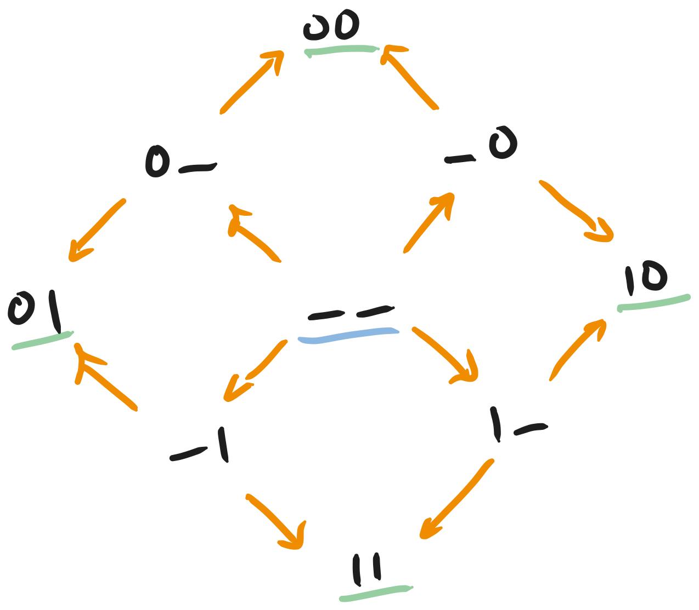
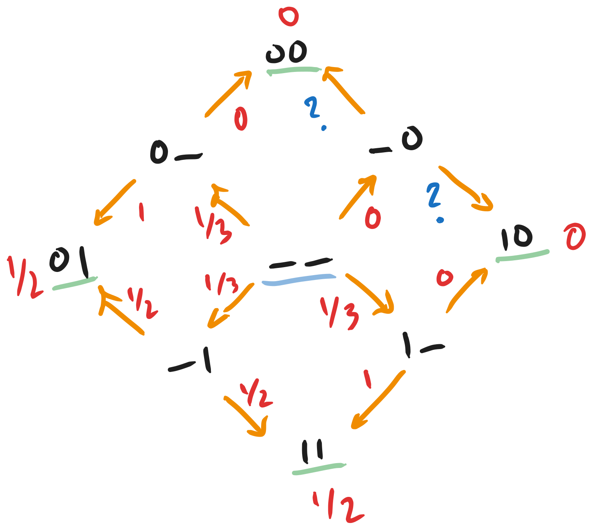
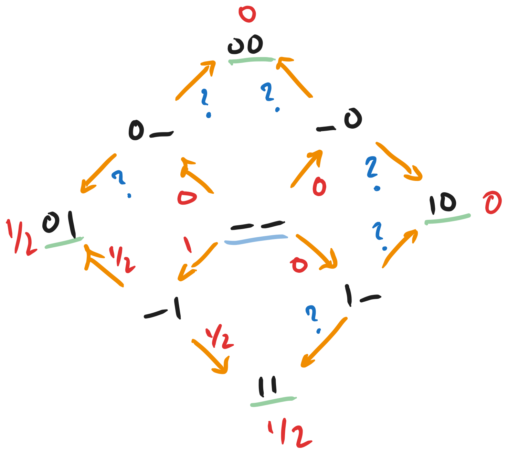
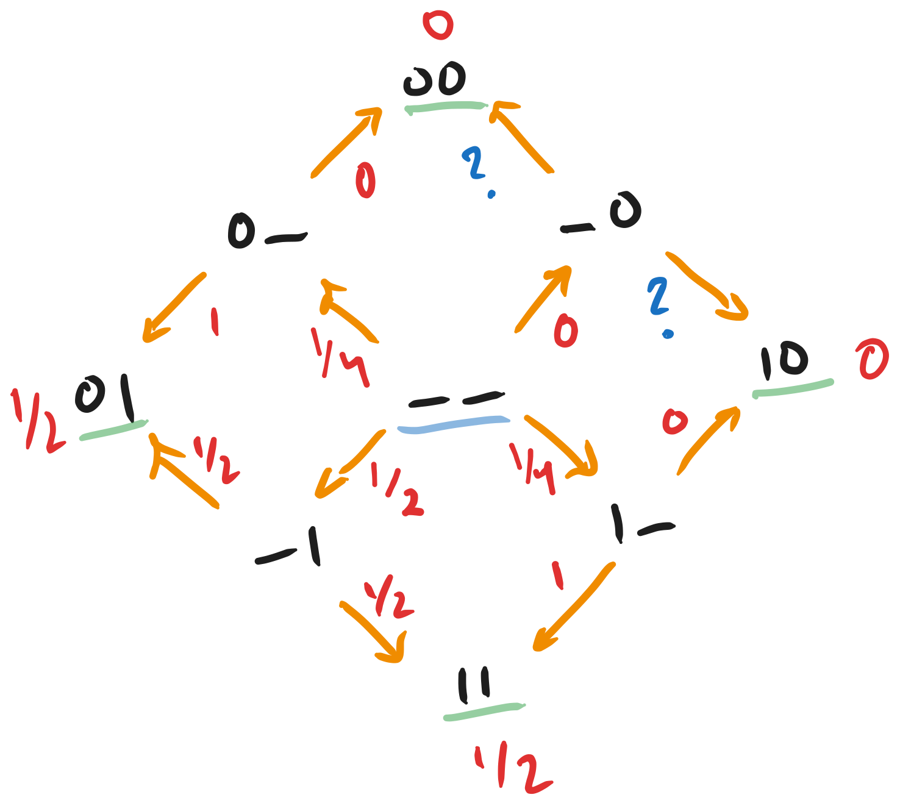
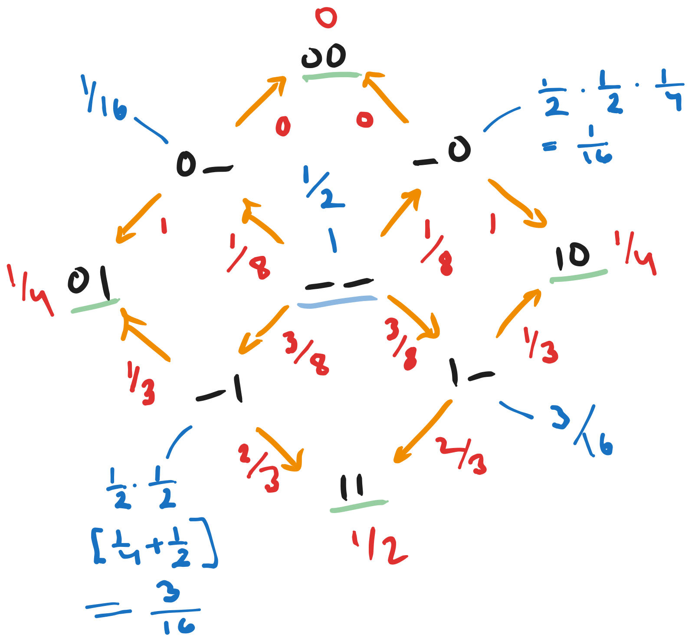

# Defining the Generative Modeling Problem for Discrete Masking Models

This is a blog post about generative models that are essentially time-inhomogenous markov chains. [^1] These include any-order autoregressive models (AO-ARM), discrete diffusion models (DDM), and discrete flow-matching models (DFM). Here we will focus on models that are used to define markov chains over the space of masked sequences. [^2] We will additionally assume that the simulation process is defined to terminate in some way (but perhaps in an unbounded number of steps [^3,^4]), where the distribution over end-states is somehow useful for generative modeling.

## Toy Problem

Even though these models can operate in continuous or discrete time, we can often map them to a discrete time markov chain.[^6] What then becomes interesting is looking at the geometry[^5] of the underlying states and the resulting transition probability distributions. Consider the following space, which shows all the valid transitions for an unmasking model operating on a length-2 binary string.

<!--  -->

Now let's say that we are trying to train a generative model over this space. Let's say we want it to produce sequences where the second position is always 1. This means it should output "0, 1" or "1, 1" and not "0, 0" or "1, 0". What should be the resulting transition probability distribution? Because there are so many edges, we can imagine two possibilities, one where each path to an output node has the same probability as any other, and another where the probability concentrates as much as possible.

<!--  -->
<!--  -->

Both have the same distribution over the unmasked positions but totally different distributions over the intermediate states. We can also imagine that there is a full spectrum of solutions interpolating between these two as well. [^9]

## Design Decisions for a Generative Model
Note that these two solutions both have different properties. Concentrating the paths might be useful if we assume a trembling hand model or some other perturbation of the transition distribution (e.g. guidance). Having the paths concentrate would means that it is hard for the guidance model to impact the rates enough to make the generative model start exploring an unfeasible sequence space. Another way to think about this is that we use softmaxes in practice so certain paths are never completely eliminated. In such a case, do we want to allow ourselves to be "mode-covering" and potentially err on the side of sampling things that are wrong, or do we want to push the model towards being more "mode-seeking" even if it means we lose some 

There are also other design decisions. For example, the "?" symbols indicate an edge that would never be trained with standard diffusion/flow-matching training. Since the probability of observing the source states for those edges ("\_0") is zero and all final states descended from that state ("00", and "10") also have probability zero, the conditional probability of $P(``00" | ``\_0")$ or $P(``00" | ``\_0")$ is undefined. For example, if we have some amount of epistemic uncertainty, and there is a possibility we would discover a small probability $p$ of sampling $``00"$ form the data, it might be a good idea to make the "?" both $0.5$. That way, as soon as I see $``00"$ in the data, I will get gradients to reduce $P(``10"|``\_0")$ and to increase $P(``\_0"|``\_\_")$. [^7] However, we can see in the case of concentrated paths that I actually do have information about the endpoints else where in the transition graph and that $P(``01" | ``0\_")$ should probably be 1, just like in the balanced path case.

Finally, the distribution of the empirical distribution might be induced by some sort of time evolution of an initial set of samples according to some underlying reward function. [^8] How do we have the model generalize the underlying reward if its training tries to make it match the empirical distribution?

uniformity is good for being able to pick paths arbitrarily
- also seems to be better at adapting to later learning signal
concentration is good for trembling hand problem
- so long as you actually train on everything so the question marks go away
  - in this sense the uniformity is a good thing because arbitrary paths means you need to get the conditionals right everywhere
- this could be nice for guidance because the number of paths is limited
- constraints are also set first, but that is why you lose the ability to pick paths arbitrarily

Summarizing the above section we see the following design choices:
1. Should the distribution be mode-covering or mode-seeking under perturbations?
2. Should the order of denoising be decided by the model or available to select at random?
3. For unobserved intermediate states, should we direct those towards known observed states or stay agnostic until we get direct information about the state?
4. How do we train the model to generalize past the currently available data, when what we really care about is eventually getting samples according to the generating reward function?

Current models must deal with any denoising order, but empirically show better results for some decoding order over others. [^10] We also know that they factor their unmasking distribution by position. In doing so, there is again both a balancing and a concentrated solution. 

<!--  -->

Interestingly, for paths that start with unmasking the first position, you may notice that the probabilities are proportional to the corresponding conditional distributions for the balanced solution, but for paths that mutate the second position, the probabilities look like the concentrated solution. Still, the probabilities of each path are uniform.

## Fitting the Empirical vs Data Distribution

In continuous state spaces, it is generally known (for images and proteins) that there are substantial problems with mode collapse when sampling unconditionally. **Is this the case with discrete models?**

Let's take a step back and think about how a model might learn this ideal distribution. Our hope generally is that, because some areas of sequence space--protein or language--are more densely populated, and our models aren't large enough to fit the whole combinatorial space of transitions well, that they will have to *smooth* out the probabilities over this net bundle (see below in the next section). As a result they will approximate the generating distribution well.

In the continuous case, we have some theoretical lines of work that confirm the mode collapse findings earlier. They find that to a certain point, the model gets a better and better approximation of the data distribution.

In the discrete case, we might not be as sure. When training the models, we pick an unmasked string, a number of positions masked, and the set of masked positions all uniformly at random. This means that the from the beginning, if there is some extra reward weighting on top of our empirical distribution, we are definitely not learning it--at least not by construction. Let's continue on, however, assuming that we somehow sample the end sequence according to this reward.

<!--  -->

Once we choose a masked sequence, because of the assumption that the distribution of transitions factors into the product of the position-wise marginals all weighted equally, we can train each of them individually with cross entropy. However, we only give them signal from the final sequence. For example, if we sample "11" and fully masked, then the model gets signal to set "\_1" and "1\_" to 1/4 and "0\_" and "\_0" to 0. When we sample "01", we similarly set "\_0" and "\_1" to 1/4 and "1\_" and "0\_" to 0.

Then consider the two incoming edges to "01". It shares the parent "\_1" with 11, which means "\_1" will get training signal $3$ times as often as "0\_". Maybe this is okay because we want to learn a pretty simple distribution for that node, but in some sense errors there matter more. [^11] More directly, what does this kind of asymmetry mean about our estimate of the likelihood of the resulting sequence?

What can we say about this formally?
We can show that the variance in the estimate of $p(x|\sigma)$, the variance in the estimate of the likelihood of a sequence as we use different decoding orders (which is $0$ for the perfectly path-balanced model) is directly related to the probability of the sequence to begin with.
Basically the equation shows that the variance is only zero when the model learns to predict the actual prob with all paths, which is not that interesting???

## Extra Credit: Mathematical Structure of This Object
Note that if you just look at the four corners of this diagram that are the denoised positions, they form the vertices of a square. Then, note that single masked positions that constitute the common string formed when masking the same position on two adjacent vertices lies on their edge. Finally the all masked token lies on the face of the square itself. This extends to arbitrary dimension. For strings of length 3, the single masks are edges, double masks are faces, and all masked constitutes the volume of the cube. I think this has something to do with the face maps, ie when you unmask a position, you drop a class of alternative points from the simplex. But there is more too--this is the product of D, S-simplices and unmasking corresponds to using a face map to drop all but one vertices on the simplex for that position.

For the masked sequences of a fixed string, we can see that this is isomorphic to the powerset where the elements in the set correspond to the masked positions, ie the empty set is the unmasked string. Because of this, we can see that the set of masked sequences forms a partially ordered set (poset) where we say one element precedes the other if the latter can be obtained by masking positions in the former (ie inclusion under the corresponding power sets). 

Adding back all the strings in the language, eventually I think this will end up being a [*net bundle*](https://arxiv.org/pdf/0707.0240). There may be further connections as well that are appropriate based on the nature of the following question:

**Extra Extra Credit: How do we think about the fact that the model is learnin ghte transitions across sequences of many lengths? What can the structure of attention tell us about the connections between the bundles.**
The positional embedding changes non-homogenously around the inserted/deleted token (ie things to the right increase/decrease). The attention value at a layer only changes if the softmax changes, but it will change for a lot of the structure.

**Maybe we can use the anthropic interp tools for an empirical study?**

[^1] Can also think of them as general denoisers but we use them to execute random runs of a markov chain. LLM people think of learning as compression. Sampling is optimization.

[^2] There are also uniform noise processes and other noise distributions. Sometimes, the distribution is sampled by training a model such that the stationary distribution of the markov chain approximates samples from the desired distribution. For example, this is the case for models that take a random string and "denoise" it to look more like something that came from the data.

[^3] In the uniform case, you are not guaranteed to have a set number of transitions.

[^4] You can also have processes that jump around the denoised time or, like diffusion models, the limiting noise distribution is not actually started with because at lives at $t=\infty$.

[^5] I think this can be called a net bundle where you have a *fiber* which is a boolean lattice for each possible string.

[^6] When is this the case?

[^7] Note for the model, each data-point has equal probability and every other point (in terms of the loss) is $0$.

[^8] This actual protein evolution over time, changes in images over the course of the last 200 years, or having a LLM generalize beyond a known mathematical result.

[^9] Are there other things that would pop up if I looked at length-3 strings?

[^10] Path planning thing and DLM experiments with AR decoding. **Also image models are known to suffer from mode collapse.**

[^11] One thing you might want to do is to hash the masked sequences or even substrings and then have some probability of rejecting a training sample if the 