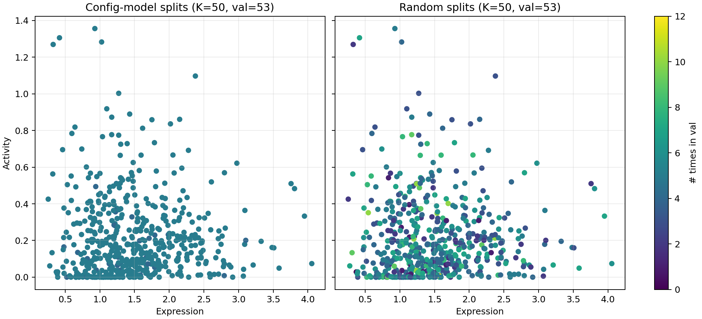
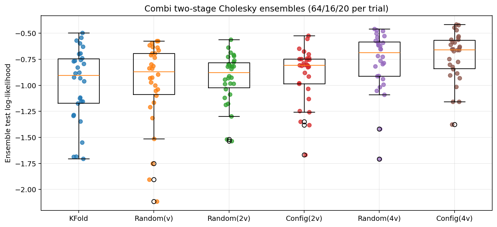

<!-- When you have such an ensemble, it turns out that the variance among the point predictions from each member is a measure of *epistemic uncertainty*. Epistemic uncertainty, as I'm using it here, refers to how sensitive the predictions from your modelsare to some factor in your model creation process. This could be the random seed controlling the training batch composition (what I had been using so far), hyperparameters, architectural choices, etc. Note that this is separate from *aleatoric uncertainty* which measures of how much of your prediction error can from irreducible noise in the actual data.

Eventually, it turned out that training a corresponding ensemble of variance predictors on the prediction errors over the validation set was an effective way of getting a better estimate of the prediction uncertainty. The problem was that, with such a small dataset (around 500 variants), the validation set was super small. I was sure I could do better with more data.

What if could somehow utilize every element of the non-test data for training the variance prediction ensemble? Well, you get exactly that if you somehow sample multiple new datasplits from your existing data, using each split to train a single mean and variance predictive model.
 -->
<section>

For some reason, I'd never used ensembles of predictors in my work before, even though it's a pretty brain-dead, obvious way to improve the performance of a simple MLP. While working on library I'm designing for a collaborator right now, I finally decided to give ensembles a shot. I ran a couple random seed, varying initialization and batch compositions and, lo and behold, my test set MSE for predicting protein activity and expression went down.

It turns out however, that getting some uncertainty quantification is one of the most elusive, but exciting parts of using ensembles. I'll discuss this more in future posts, but ensembles like the one I described above, which randomize weight intializations and training batches, don't do a great job at uncertainty quantification by themselves. Most members of the ensemble have the same predictions on a new datapoint. Training a separate variance predictor to maximize the likelihood of the prediction errors on a validation set does way better.

The only problem is, most assay-labeled protein function datasets are quite small so the validation set is puny. In my case, I was working with a dataset of around 500 data points, which gave me a validation set of 80 proteins. In this post, I'm going to discuss an interesting little trick with some nice theoretical properties that lets you use all of your non-heldout data for this kind of variance prediction instead of just your validation set.

Now strictly speaking, there are simple ways to achieve this: splitting your data into $k$ disjoint validation sets or sampling $k$ random splits. However both of these approaches come with trade-offs.

If you use $k$ disjoint subsets, your coverage of the data will be uniform, but each variance predictor will be quite poor since it was have been trained on very little data. The contents of each data split will also be correlated so the ensemble predictions will not be independent of each other; this makes their use for uncertainty quantification harder.

If you use $k$ random splits, the validation set sizes will be larger and the splits will have been sampled independently. However, some datapoints will be amplified or suppressed at random because the frequency of appearing in the validation sets for each data point will be binomially distributed.

Turns out, there is a middle ground. Inspired by the [*configuration model*](https://en.wikipedia.org/wiki/Configuration_model), we uniformly sample from the space of random splits that satisfy our constraints. Note that the assignments themselves won't be completely independent because of the uniform coverage constraint. The setup will basically be a generalization of taking $k$ disjoint subsets. 

The algorithm is inspired by the following equality. If we want $k$ splits of size $n$, using $N$ total data points, we must have each data point appear exactly $r$ times, such that $Nr = kn$. We can think of this as constructing a random bipartite graph where one set of nodes represents the data points and the other set represents the splits. Each data point has exactly $r$ edges and each split has exactly $n$ edges. The configuration models defines a simple algorithm for sampling such random graphs.

```python
def sample_configuration_model(N, k, n):
    # N: total number of data points
    # k: number of splits
    # n: size of each split
    # Calculate r, number of times each data point should appear
    r = (k * n) // N

    # Create r edges for each data point, but don't connect them to any splits yet
    half_edges = np.repeat(np.arange(N), r)

    # Shuffle them all so assignments are independent
    np.random.shuffle(half_edges)

    # Now split them into k disjoint sets
    return half_edges.reshape(k, n)
```

This approach clearly allows nodes to appear more than once, but more sophisticated shuffles can be used to remove this problem. For now, we can just see that empirically, this addresses our coverage and uniformity issues for the frequency of a data point appearing in a given validation set using the following two simulations. 

In the first simulation below, we see the number of times each data point appears in any validation set. We can see that the configuration model, by construction, hits the target frequency, while the random approach is binomially distributed. Note that the configuration model concentrates on a single number by construction (or two if the division is not exact).

<div style="width: 100%; max-width: 55%;">
  <iframe
    src="/drafts/predictor-training/config_vs_random_total_appearances/"
    title="Configuration model vs random split total appearances simulation"
    style="width: 100%; border: 0; display: block;"
    loading="lazy"
    scrolling="no"
    data-auto-height="true"
  ></iframe>
</div>

In this second simulation, we can see that this coverage and uniformity does not come at a significant cost in terms of data points sometimes appearing multiple times in a validation set. Note that data in random splits appear at most once because we sample without replacement.

<div style="width: 100%; max-width: 55%;">
  <iframe
    src="/drafts/predictor-training/config_vs_random_per_split/"
    title="Configuration model vs random split per-split simulation"
    style="width: 100%; border: 0; display: block;"
    loading="lazy"
    scrolling="no"
    data-auto-height="true"
  ></iframe>
</div>

Visually, we can see this play out in the dataset. Below are the activity and expression levels for some real data points. They are colored by how many times they appear in the validation data across the ensemble. I don't know about you, but I feel much more confortable with the configuration model.

<figure>
  
  <figcaption>Figure 1: Both panels show the activity (y-axis) versus the expression (x-axis) of around 500 combinatorial protein sequence variance. Color indicates the number of validation sets each data point appears in. On the left is the data assigned to validation sets by the configuration model, on the right, using random splits.</figcaption>
</figure>

But does this actually buy us anything? The difference is small, but reliable. The remaining figures will show real performance for ensembles of ten MLPs with two hidden layers trained by sampling validation sets using $k$ disjoint subsets (which I'll refer to as k-fold), random splits, or configuration model splits. Unlike k-fold, the random splits and configuration model can have validation sets of larger size than the number of data points divided by the ensemble size (40 points). For those two methods, we used validation sets that were twice as large (80 points) and four times as large (160 points).

<figure>
  
  <figcaption>Figure 2: Log-likelihood of ensembles trained on data splits using each method on around one-hundred test samples. Thirty trials were performed for each method. Models were initialized using the same random seed for each of the thirty trials. The mean log-likelihood for each method is: -0.99 (k-fold), -0.97 (random), -0.93 (random with 2x data), -0.89 (configuration model with 2x data), -0.77 (random with 4x data), -0.72 (configuration model with 4x data). The boxplots show the median and quartiles for each method. </figcaption>
</figure>

From this plot we can see two things. First, increasing the validation set size decreases the variance in the ensemble log-likelihood. We can see that for the random model, that the mean increases slightly but the median doesn't change. Furthermore, note that the configuration model with 1x data reduces to k-fold. We can see in contrast to the random split, both the mean and the median have improved significantly, and so has the variance of the results. In any case, using the configuration model lets us squeak out an extra 0.05-0.10 increase in log likelihood. As we can see in the 4x data trials, the configuration model continues to outperform the random approach but increasing data size clearly dominates the difference in sampling strategy.

That being said, the difference is not substatial enough to give a qualitative change in performance. Scroll through the predictions below to see for yourself. It is hard to tell just visially if the configuration model or random split ensemble performs better.

<div style="width: 100%; max-width: 55%;">
  <iframe
    src="/drafts/predictor-training/gif_frame_slider.html"
    title="Config vs random GIF frame slider"
    style="width: 100%; border: 0; display: block;"
    loading="lazy"
    scrolling="no"
    data-auto-height="true"
  ></iframe>
</div>

Going forward, what would be interesting to see whether you can reverse this whole framing and instead actively create validation sets likely to give you the best performance on held-out data from the same distribution. Are uniformly sampled sets the best you can do?

<script>
(() => {
  const embeds = Array.from(document.querySelectorAll("iframe[data-auto-height='true']"));

  function resizeEmbed(embed) {
    try {
      const doc = embed.contentDocument || embed.contentWindow?.document;
      if (!doc) return;
      const body = doc.body;
      const html = doc.documentElement;
      const h = Math.max(
        body?.scrollHeight || 0,
        body?.offsetHeight || 0,
        html?.scrollHeight || 0,
        html?.offsetHeight || 0,
      );
      if (h > 0) embed.style.height = `${h}px`;
    } catch {
      // Ignore cross-origin or transient load errors.
    }
  }

  function attach(embed) {
    embed.addEventListener("load", () => {
      resizeEmbed(embed);
      setTimeout(() => resizeEmbed(embed), 100);
      setTimeout(() => resizeEmbed(embed), 400);

      try {
        const doc = embed.contentDocument || embed.contentWindow?.document;
        if (!doc) return;

        if (typeof ResizeObserver !== "undefined") {
          const observer = new ResizeObserver(() => resizeEmbed(embed));
          if (doc.body) observer.observe(doc.body);
          if (doc.documentElement) observer.observe(doc.documentElement);
        }
      } catch {
        // Ignore transient observer attach errors.
      }
    });

    // Fallback for dynamic chart updates inside iframes.
    let ticks = 0;
    const interval = setInterval(() => {
      resizeEmbed(embed);
      ticks += 1;
      if (ticks > 120) clearInterval(interval);
    }, 500);
  }

  embeds.forEach(attach);
  window.addEventListener("resize", () => embeds.forEach(resizeEmbed));
})();
</script>

</section>

