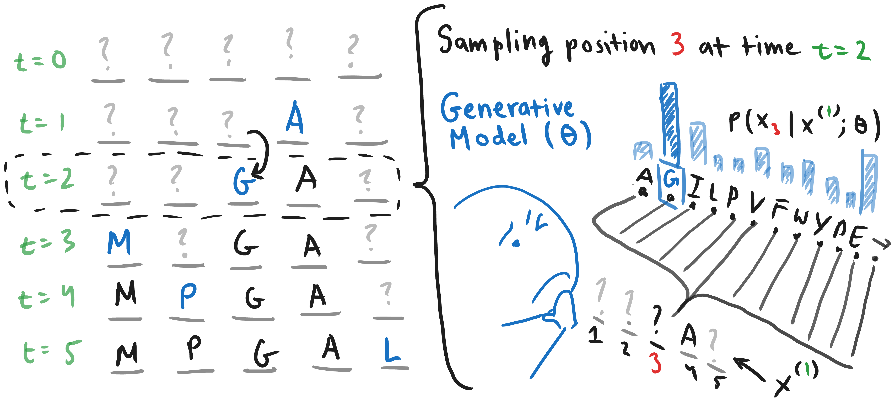
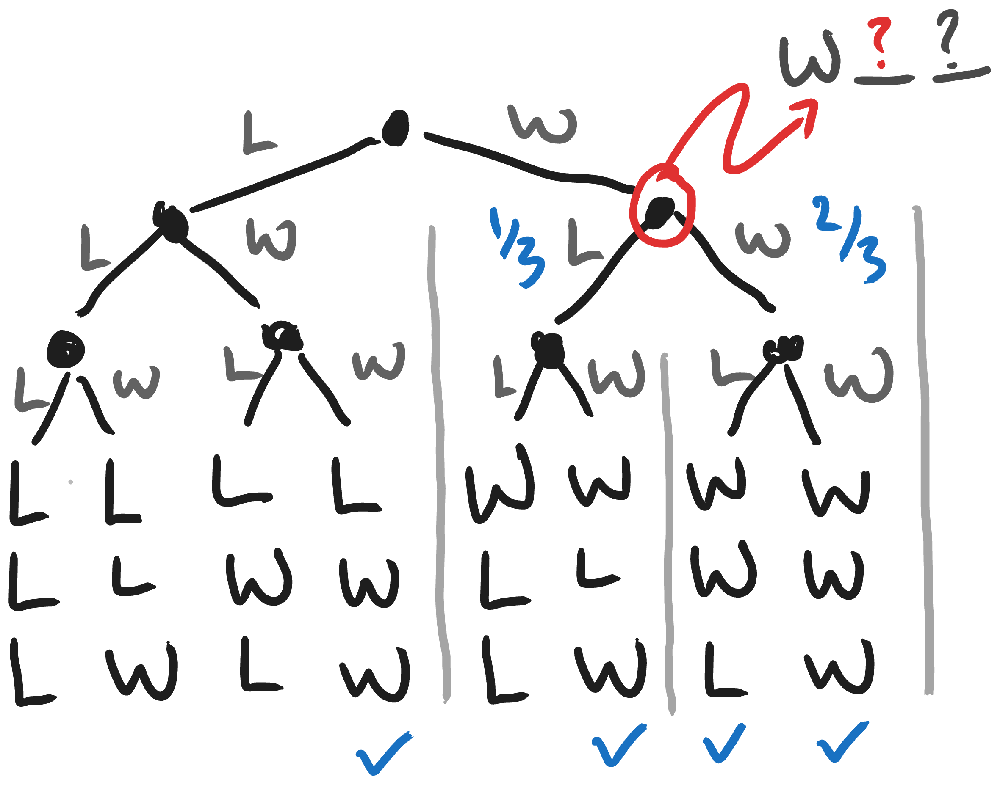
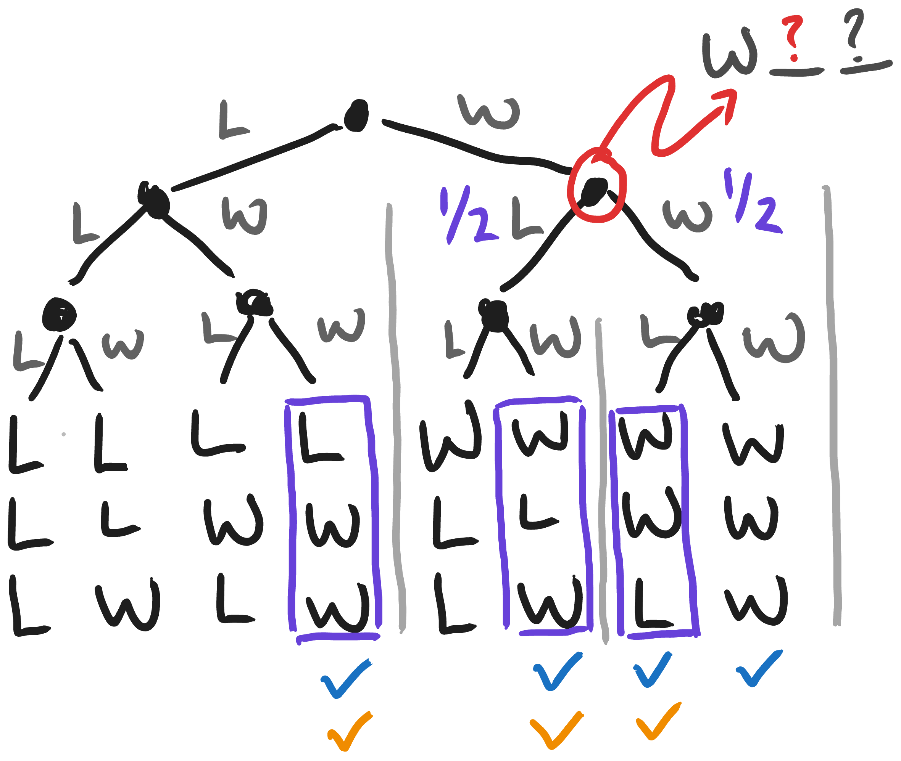

<section>

<!--
Benefits of guidance vs DPO--not SFT
- Lighter weight so you can change design objectives on the fly
- Easier to ensemble predictors than generative models (although LoRA)
- You have more control over the architecture of the predictor than the generative model, so you can bake in more domain knowledge
- You can do hacky stuff like setting hard minimums for mutational distance
- DPO might have noisier gradient estimates because order matters?? Maybe that's shared for both though.
-->
Generative models of protein sequence, such as ProteinMPNN, ESM, and ProGen, lack an interface for users to specify their functional design objectives. Models like ProteinMPNN and ESM3 can be used to generate sequences that fold into a target backbone, but they have no understanding of the biological properties we actually care about. <!-- For example, someone designing a biologic might like to achieve a certain balance of binding affinity, off-target activity, and thermostability. -->

In our recent pre-print, [ProteinGuide](https://arxiv.org/abs/2505.04823), we describe a method that allows users to design libraries according to multiple functional constraints simultaneously. It also enables users to get more out of pretrained generative models by leveraging their wet-lab data during the design process. In this guide, we will review how ProteinGuide works, how to troubleshoot some common issues, and what a practical workflow for using ProteinGuide looks like.

ProteinGuide provides a way to extract sequences from a pretrained generative model that are predicted to satisfy functional properties we care about. To do this, ProteinGuide uses a lightweight property prediction model, trained on your wet-lab data, to iteratively "guide" the generative model towards sequences with higher fitness.

Although ProteinGuide is theoretically sound, its performance can be contingent on whether or not:
1. the generative model produces relevant sequences for the task (even if they are suboptimal), and
2. the predictive model sufficiently captures your remaining preferences about which proteins would be desireable.

These two assumptions can be restated as:
1. the generative model must accurately capture your prior beliefs about which sequences make sense for this task
2. the predictive model must be able to determine which sequences from your prior have sufficiently high fitness, based on your *wet-lab data*.

In this guide, we first review the basic procedure for using ProteinGuide, assuming these two conditions hold. Then we examine common ways in which these assumptions break down, and how these issues can be addressed. Finally, we walk through a practical workflow for ProteinGuide. Each section is fairly self-contained, so feel free to jump to the section that is most relevant to you.

<!-- TODO link the FAQs -->
<!-- TODO write the post on unifying discrete generative models -->

</section>

<section>

## Table of Contents

<nav>
  <ol>
    <li><a href="#intro">ProteinGuide in Theory</a></li>
    <li><a href="#reality">Reality Check</a></li>
    <li><a href="#workflow">A Practical Workflow</a></li>
  </ol>
</nav>

</section>

<section>

## ProteinGuide in Theory {#intro}

This section provides an intuitive introduction to protein sequence generative models and ProteinGuide. 

ProteinGuide uses a predictive model of protein fitness to guide a pretrained sequence generative model.  To understand how this works, we first need to understand how generative models operate. Then we will layer in how the predictive model enables guidance, and how the predictive model is trained.

Generative models are trained to "fill-in-the-blank". As input, they take protein sequences where some positions are masked and they predict the missing amino acids. This allows them to design sequences by iteratively inserting amino acids into the masked positions, until the sequence is fully unmasked.

An important detail is that they don't directly output the amino acid to be inserted. Instead, they look at all the 20 amino acids and assign each of them a probability of being the correct amino acid for that position. We then look at these probabilities and use them to randomly sample an amino acid to actually insert.

<figure class="fullwidth"></figure>

<!-- <pre><code>
Generative Model Sampling Procedure:

1. Start with a fully masked sequence: s = &lt;mask&gt;&lt;mask&gt;&lt;mask&gt;...&lt;mask&gt;
2. While s contains &lt;mask&gt;:
   a. Input s to the generative model
   b. The model returns probabilities of amino acids to insert at each position
   c. Randomly select a position to unmask, call this position i
   d. Insert an amino acid at position i according to the model's probabilities
   e. go to step 2
3. Return s
</code></pre> -->

 

When we talk about generative models here, we're referring to any-order autoregressive models (or equivalently masked language, discrete diffusion, or discrete flow matching models). 
  
We model a protein as a sequence $x$ of amino acids $\mathcal{A}$ of length $L$ (*i.e.* $x \in \mathcal{A}^L$). Let $M(x, t):(\mathcal{A}^L \times [0, 1]) \rightarrow \\{\mathcal{A} \cup \text{\<mask\>}\\}^L$ be a function that randomly masks each position in $x$ with probability $t$. The generative model, typically parameterized by a decoder-only transformer, estimates the marginal distribution  $P(x_i|M(x, t))$ at all masked positions $x_i$, conditioned on a partially masked input sequence. We denote the distribution induced by the generative model's predictions $P_\theta$.


Because of this, the generative model is not deterministic. Below is a video showing ESMC generating 8 different sequences in parallel. Observe that even though they all start with the same masked sequence, each sequence ends up being different.

<figure><video src='esm-sampling-crop.mp4' alt='Timeseries of the Masked Generation Process/' controls autoplay loop muted style='max-width:100%;height:auto;' /></figure>

This non-determinism is a very important property. It is exactly what allows us to use the generative model to create a library of diverse proteins. Using a generative model, the chance that we produce a given variant is proportional to how good the model thinks it is. But how does the model decide? Above I said that the model

>look\[s\] at all the 20 amino acids and assign\[s\] each of them a probability of being the correct amino acid for that position.

So what is this "probability of being correct"?

Imagine that we roll out all possible sequences that the model could generate from a given partially masked sequence. To keep things simple let's assume our "protein" is three amino acids long, is only made up of Leucine (<code>L</code>) and Tryptophan (<code>W</code>), and that we're unmasking it from left to right. We can now map out all the possible sequences we could generate as a tree. At each node, the model must decide which amino acid to add next. Each choice it makes moves it down the tree until it reaches a complete sequence at the end. 

For our toy problem, we'll say that any sequence with more <code>W</code>s than <code>L</code>s is a "real" protein. We'll label each of these with a blue checkmark.

<figure></figure>

Our goal is to create a generative model that is trained to all real proteins with equal probability. <!-- Of course, for a real sequence dataset like <code>Uniref</code> or <code>SwissProt</code>, it is not possible to memorize all the sequences so our models will be forced to understand properties of real proteins-->   It turns out that it is really simple to define this idea model. Consider the node circled in red. All the model has to do is look downstream of a choice it might make and count how many real proteins it can generate from that point. Then it takes each of those counts and divides by the total number of real proteins it can generate from that point. If the model adds an <code>L</code> (left-hand branch in the tree), there is only one real protein it can make, which is <code>WLW</code>. If it adds a <code>W</code>, there are two real proteins it can make: <code>WWL</code> and <code>WWW</code>. Therefore, the model assigns a probability of $1/3$ to inserting an <code>L</code> and $2/3$ to inserting a <code>W</code>.

### Guiding with a Predictive Model

Now let's say, for our design task, we want a protein that has at least one <code>L</code>. Of course, the protein has to be "real", so this requirement stacks on top of the first. We can mark the "real" sequences with at least one <code>L</code> with an orange checkmark, and box the resulting high fitness sequences in purple.

<figure></figure>

Now notice that the *conditional* generative model has different probabilities for the two choices. The probability of adding a <code>W</code> went down from $2/3$ to $1/2$, and the probability of adding an <code>L</code> went up from $1/3$ to $1/2$. 

In ProteinGuide, the predictive model tells us the probability that the generative model will produce a sequence that satisfies our design task. To get the guided conditional model—the model that randomly samples from the sequences that satisfy our requirements—it turns out all you have to do is multiple the pretrained generative models proabbilities by the predictive model's probabilities and re-normalize. The intution for this is just that:{% marginnote "Each fraction is colored by the model that estimates it. The blue fraction (real proteins / all sequences) is what proportion of the whole tree the generative model thinks look like plausible sequences. The orange fraction (high-fitness proteins / real proteins) is what proportion of the generative model's sequences the predictive model estimates to be high fitness. Multiplying them gives the ProteinGuide conditional model (high-fitness proteins / all sequences) which picks out only the high fitness variants in the sequence landscape." %}

$$\color{purple}{\frac{\text{Proteins with high fitness}}{\text{All sequences}}} = \color{blue}{\frac{\text{Proteins}}{\text{All sequences}}} \times \color{darkorange}{\frac{\text{High fitness proteins}}{\text{Real proteins}}}$$

All that's left is to train the predictive model. This ends up being quite simple. We take the sequences and fitness measurements from our wet-lab data and train a model to predict the fitness from the sequence. The only twist is that before inputting the sequence to the predictive model, we randomly pick a subset of the positions to mask. Nevertheless, this ends up just being a standard supervised learning problem, and you can use any architecture or training method you like. Because our predictive model ends up predicting the probability of success from a partially masked, or "noisy" sequence, it is sometimes referred to as a noisy classifier or noisy predictor.

<!--**Margin note on noising the samples.**-->

## Reality Check {#reality}

## A Practical Workflow {#workflow}

</section>