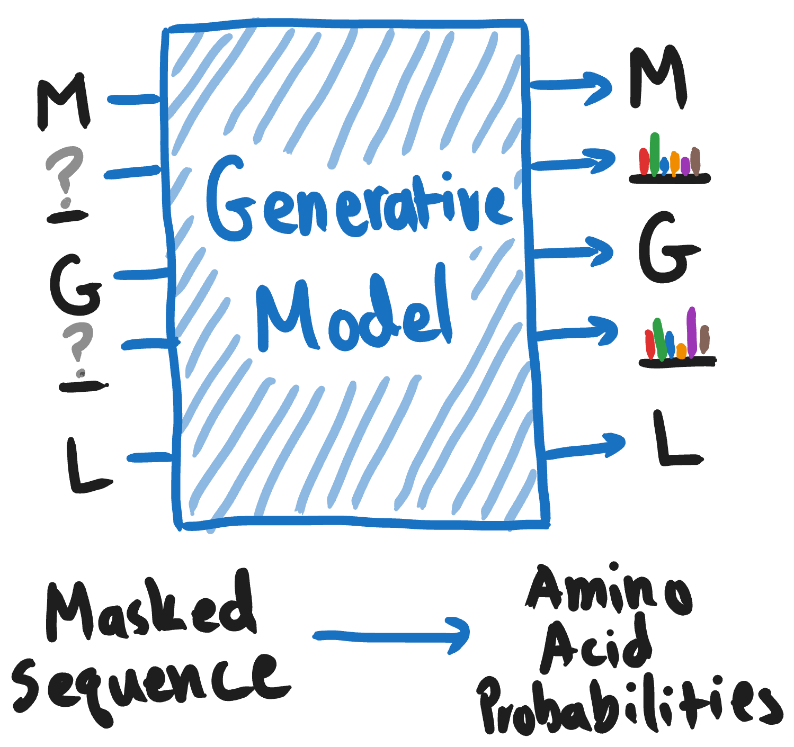
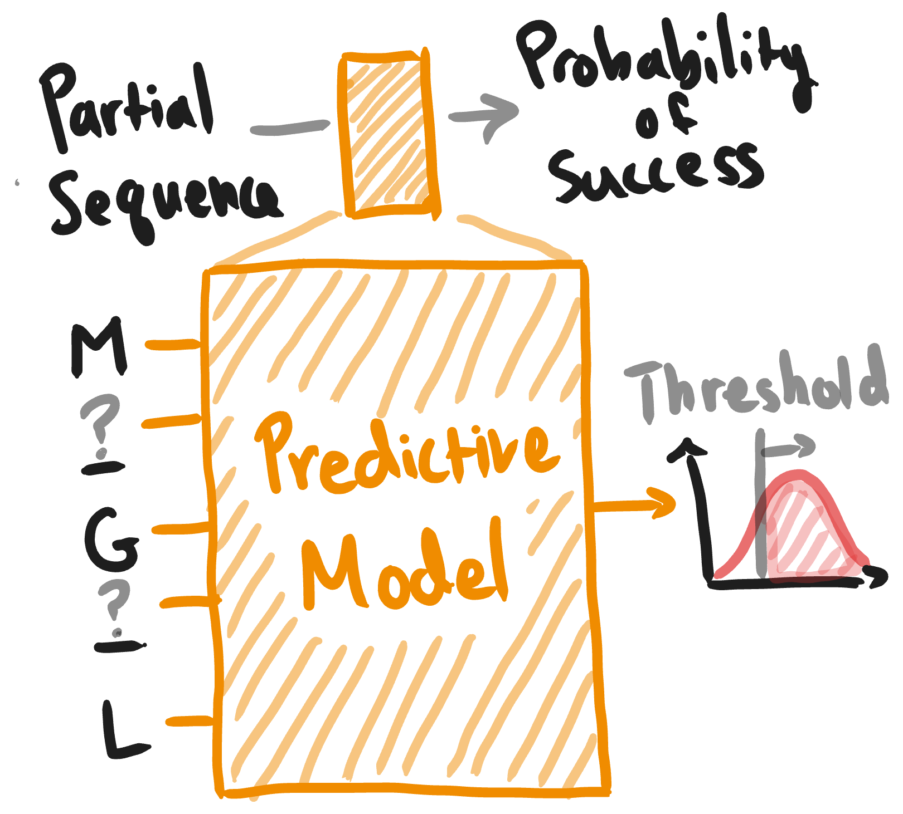

<section>

Earlier this year, we released a [pre-print](https://arxiv.org/abs/2505.04823) entitled ProteinGuide. It describes a general method for blending wet-lab data and pretrained generative models for library design.

This page contains a brief overview of ProteinGuide and an index of resources to help you use it. These links cover everything from getting up to speed on the [basics of generative modeling](./ddm-and-pg-intuition.md), to making [ProteinGuide work in practice](./proteinguide-in-practice.md), and [implementing your first pipeline](https://ishan-gaur.github.io/proteingen/workflows/protein-guide/) in Python.

If you have any questions or comments, we'd love to hear from you! Feel free to email me at <a href="mailto:ishang@berkeley.edu">ishang@berkeley.edu</a>.

## Resources

<nav>
  <ol>
    <li><a href="./ddm-and-pg-intuition/">Intuitive Introduction to ProteinGuide</a></li>
    <li><a href="https://arxiv.org/abs/2505.04823">ProteinGuide Paper</a></li>
    <li><a href="./proteinguide-in-practice/">Using ProteinGuide in Practice</a></li>
    <li><a href="https://ishan-gaur.github.io/proteingen/workflows/protein-guide/">ProteinGuide Python Workflow on ProtGen</a></li>
  </ol>
</nav>

## Overview

Pretrained generative models such as ESM3, ProteinMPNN, and DPLM, are trained to fill in partially masked protein sequences. This enables them to generate full sequences that seem like "real" proteins, but as protein designers, they offer a very limited interface for us to specify our design goals. These goals might go beyond specifiying a static structure, including complex properties such as catalytic activity, on-/off-target specificity, and sensitivity to environmental factors like temperature or pH.

ProteinGuide provides a way to extract sequences from a pretrained generative model—like ProteinMPNN, ESM, or ProGen—that are predicted to satisfy these functional properties of interest. To do this, ProteinGuide uses a lightweight property predictive model to iteratively "guide" the generative model towards sequences with higher fitness. This predictive model is *trained on your wet-lab data*, allowing you to leverage your experimental results to design better proteins, and improve your designs over time as you collect more data.

The <a href="./ddm-and-pg-intuition/">Intuitive Introduction to ProteinGuide</a></li> and <a href="https://arxiv.org/abs/2505.04823">ProteinGuide Paper</a> describe ProteinGuide and its applications at length.

Although ProteinGuide is theoretically sound, its performance can be contingent on whether or not:
1. the generative model produces relevant, even if suboptimal, sequences for your task, and
2. the predictive model sufficiently captures the remaining factors that determine your protein's fitness.

These two assumptions can be restated as:
1. the generative model must capture your prior beliefs about which sequences make sense for this task
2. the predictive model must accurately determine, based on your wet-lab data, which sequences from your prior are most desireable.

In <a href="./proteinguide-in-practice/">Using ProteinGuide in Practice</a>, we discuss how to evaluate these assumptions and make ProteinGuide work for your specific use-case. 

When customizing ProteinGuide to your particular situation, its useful to be able to test out several different options for your library design pipeline *in silico* before you have to commit any wetlab budget. To this end, we've recently released the [ProteinGen Python package](https://github.com/ishan-gaur/proteingen). 

[ProteinGen](https://github.com/ishan-gaur/proteingen) is a general-purpose package for library design. It supports all the major pretrained sequence generative models (incl. inverse folding) and unifies them under a single framework. This makes it super simple to try different models, sampling strategies, and conditional generation methods. ProteinGen supports several library design techniques, not just ProteinGuide, but to help you get started, we provide a step-by-step tutorial for implementing your first ProteinGuide pipeline using ProteinGen [here](https://ishan-gaur.github.io/proteingen/workflows/protein-guide/).

</section>